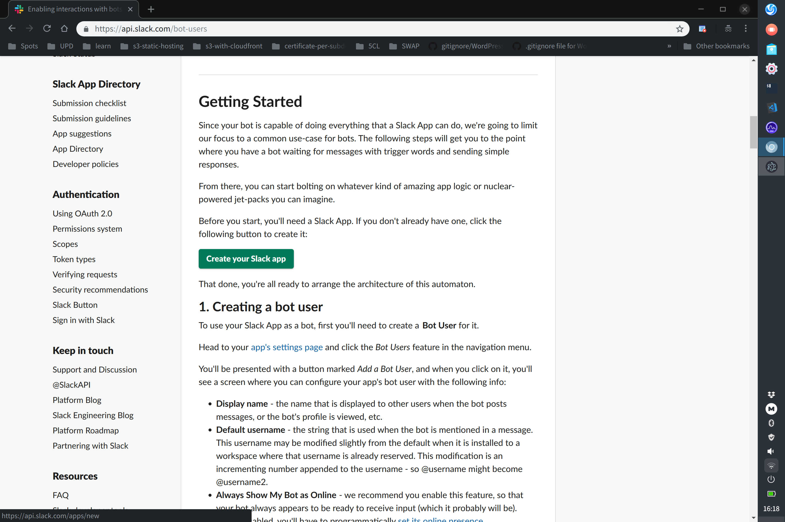
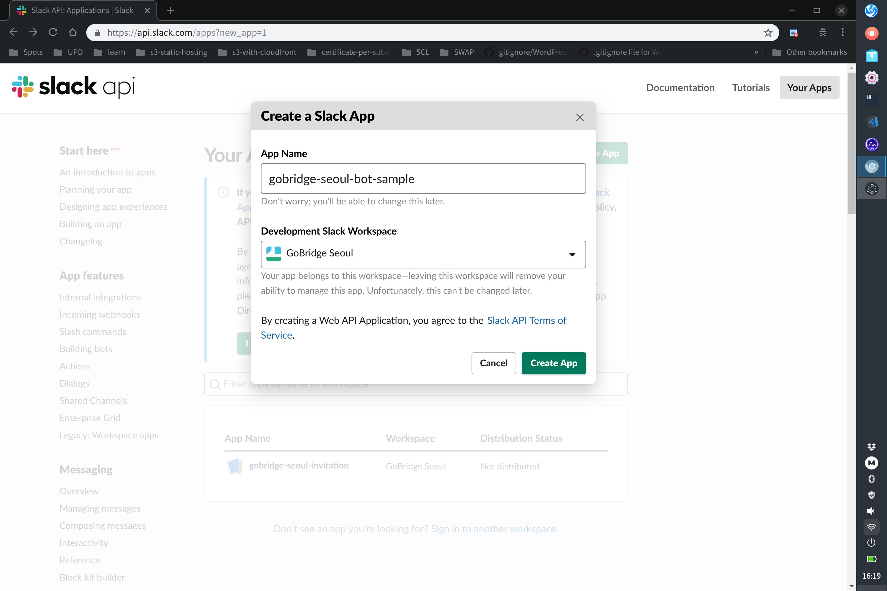
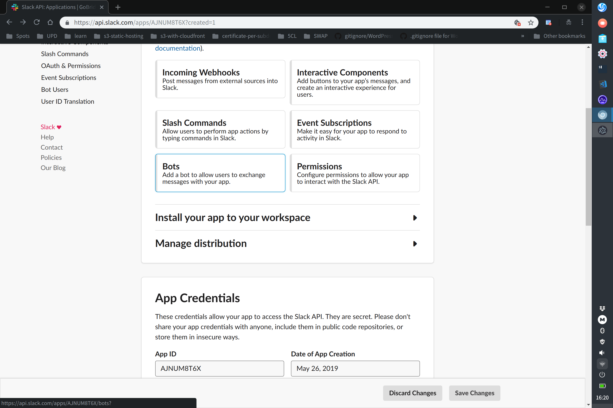
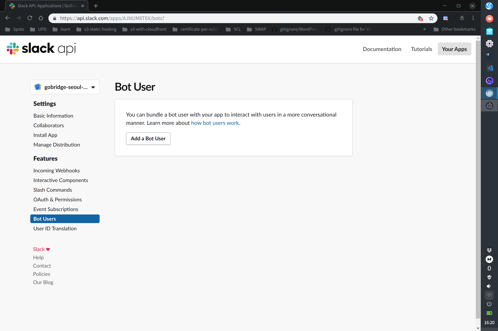
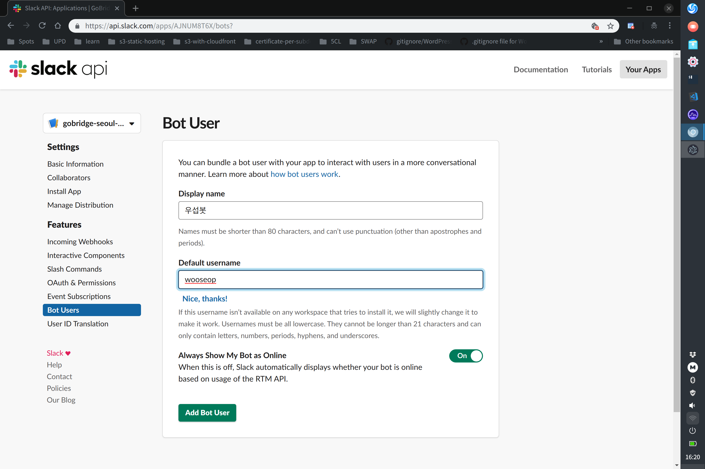
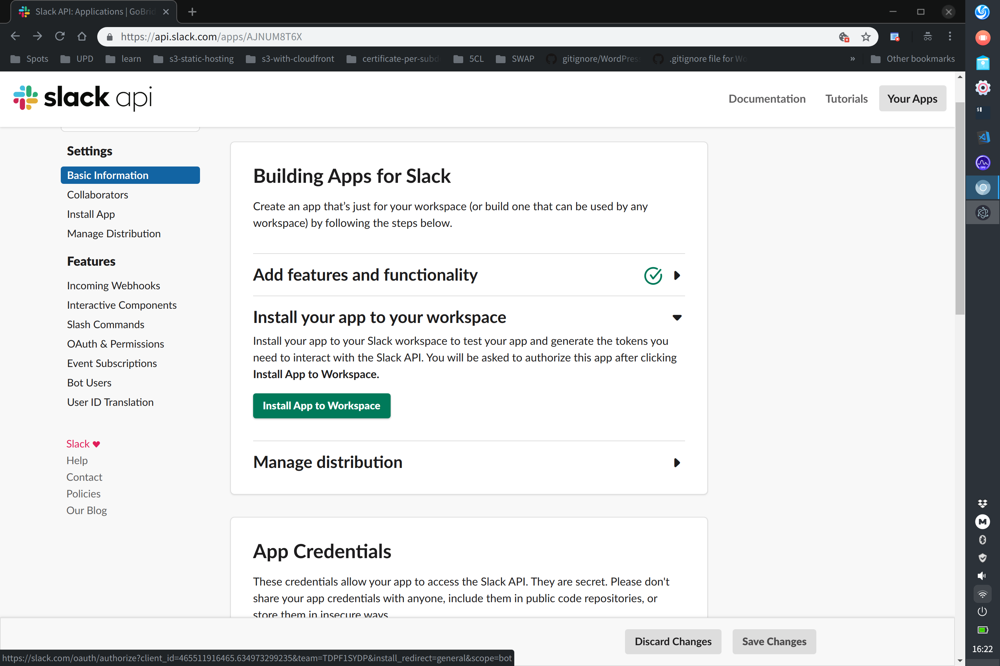
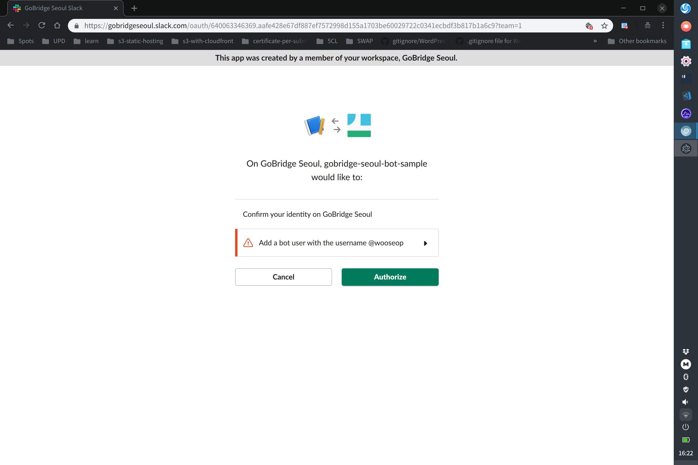
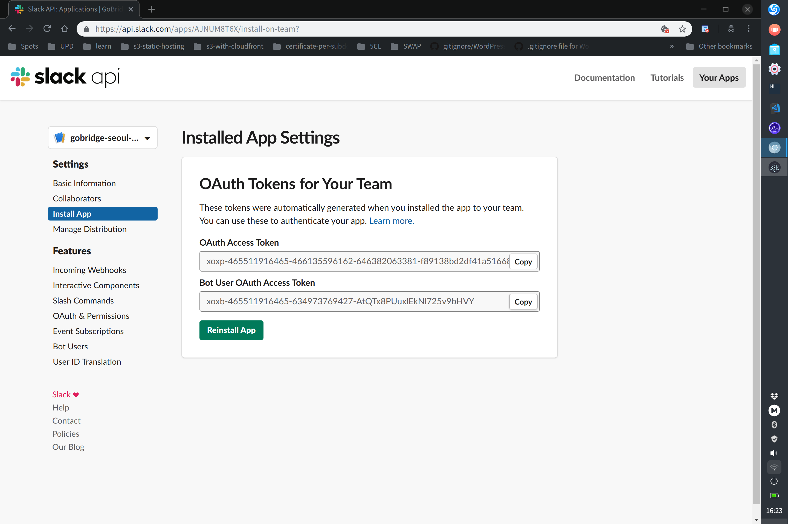

# 토큰 발급받기

1. <https://api.slack.com/bot-users>에서 중간의 녹색 `Create your Slack app` 버튼을 누릅니다.

2. 봇의 이름을 고르고, `Workspace`는 `GoBridge Seoul`로 해주세요.

3. 넘어간 페이지에서 중간의 `Bots`를 눌러주세요.

4. `Add a Bot User`를 누르고, 적당한 이름을 골라줍시다. `Display name`으로 봇을 호출하게 됩니다.

5. `Install App to Workspace` 버튼으로 해당 봇을 우리 워크스페이스에 설치해줍니다.

6. 왼쪽 메뉴의 `Install App`로 이동합니다. `Bot User OAuth Access Token` 값을 오른쪽 `Copy` 버튼을 눌러 토큰 값을 복사합니다.
